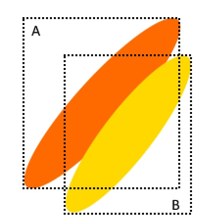

# Фреймворк для детекции вытянутых и поврёнутых объектов, расположенных на небольшом расстоянии друг от друга


## В чём смысл:

В реальной жизни бывают случаи, когда baseline-подход дететкции объектов через bbox-ы не работает. Пример - поле пшеницы с  в ветренную погоду. В нём колосья имеют сразу 2 проблемы:

- если колос направлен по диагонали кадра, то его площадь в bbox-е минимальна
- несколько колосьев оказываются рядом и параллельны друг другу

При классическом подходе если одновремменно произойдут обе проблемы, то процедура non-maximum suppression отбросит несколько несколько колосьев.
В предложенном нами варианте этой проблемы нет.




## Установка

Сохраните файл [install.sh](install.sh) и запустите команду

```console
sh install.sh
```


## Структура проекта

В фреймоврке есть 2 подхода:

1. базовая модель детекции прямоугольников [baseline](baseline)

2. обнаружение отрезков [shortcut_detection](shortcut_detection)

